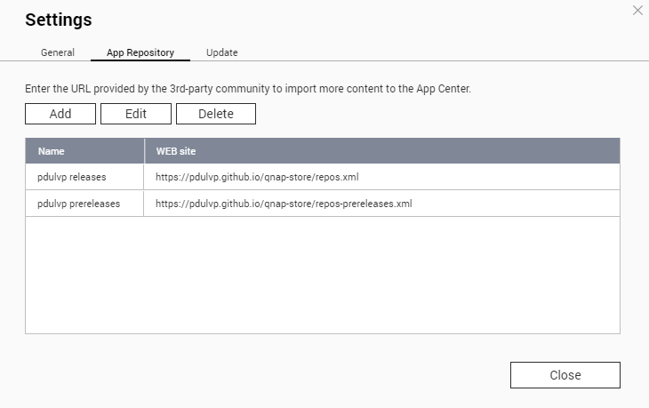

# 3rd app party QNAP store

This repository provides an automatic way to retrieve latest releases of all [My QNAP Apps](https://github.com/search?l=&q=qnap+user%3Apdulvp+label%3Aqnap-store&type=repositories).

## Installation

In the `Settings` of the `AppCenter` on your QNAP

Add the wanted store url:

`Releases` [https://pdulvp.github.io/qnap-store/repos.xml](https://pdulvp.github.io/qnap-store/repos.xml);

`Pre-Releases` [https://pdulvp.github.io/qnap-store/repos-prereleases.xml](https://pdulvp.github.io/qnap-store/repos-prereleases.xml);
